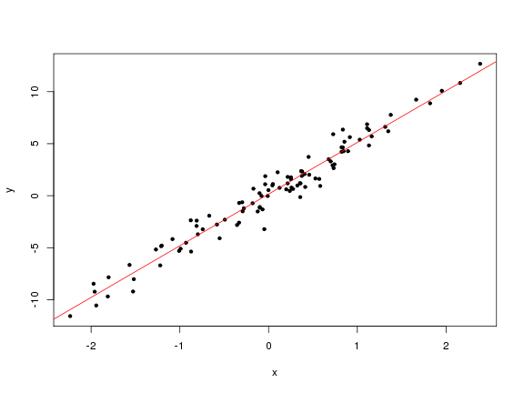
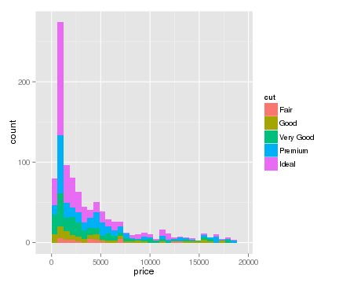
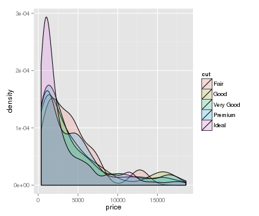

## Outline

- R: Born for statistics.
- Thousands of packages for data analysis
- Reproducible report
    - knitr
    - slidify
    - rmarkdown
- Data Visualization
    - ggplot2
    - rCharts
- Web application
    - shiny

--- .segue .dark

## The GNU-R project

---

## R: Born for statistics

History:

- From the S language, which is inspired by Scheme.
- Created by [Ross Ihaka](http://en.wikipedia.org/wiki/Ross_Ihaka) and [Robert Gentleman](http://en.wikipedia.org/wiki/Robert_Gentleman_%28statistician%29).

---

## R: Born for statistics

R is strong for statistical missions. 

- Strong matrix calculation ability
- Native support for statistics
- Abundant third-party packages

---

## R: Born for statistics


```r
groupA = rnorm(100,5,3)
groupB = rnorm(25,10,3)
groupA
```

```
##   [1]  3.6971  6.7248  7.9683  2.2308  5.4614  8.4408 10.2419  3.2499
##   [9]  1.5689  6.4886  5.7686  7.4497  2.0098  7.9981 -3.3444  2.7594
##  [17]  8.1024  7.3294  1.9188  5.2265  4.7017  3.6980  3.1508  2.5169
##  [25]  9.2808  3.3313  3.2642  6.0893  6.2068  3.8526  4.8694  3.9282
##  [33]  3.6972  8.3397 -2.0764  7.0569  6.0553 -0.2693  1.4528  4.9927
##  [41] 12.1736  5.0689  5.7101  4.5866  3.3669  6.3000  6.1992  9.1174
##  [49]  5.7471  6.1049  6.6233  8.4067 11.1244  0.7993 11.1956 -1.0213
##  [57]  5.2068  3.1728  6.6949  7.0583 -1.1802  3.9823  4.2519  2.9199
##  [65]  8.6317  3.1134  1.7561  8.2144  2.3034  3.3286  5.8907  6.0953
##  [73]  3.9319  3.6344  7.6199  4.3639  6.0934  3.5172  7.8766  4.5316
##  [81]  3.2731  2.8586  3.6398  5.1615  2.2337  5.6640  6.8103  3.4826
##  [89]  6.9874  6.8977  7.4295 10.9932  5.4489  4.4760  6.6679  2.5085
##  [97]  5.7805  3.9149  8.1647  2.3932
```

```r
groupB
```

```
##  [1]  7.354 10.955 18.419  9.167  8.607 14.284  6.382  5.474 13.433 13.471
## [11] 14.389  4.965  9.203  7.319  9.172  5.982  8.708  3.268 12.279  4.139
## [21] 13.012 13.124 14.338  8.921 11.384
```

---

## R: Born for statistics


```r
t.test(groupA,groupB,alternative = c("less"))
```

```
## 
## 	Welch Two Sample t-test
## 
## data:  groupA and groupB
## t = -5.941, df = 30.88, p-value = 7.357e-07
## alternative hypothesis: true difference in means is less than 0
## 95 percent confidence interval:
##    -Inf -3.475
## sample estimates:
## mean of x mean of y 
##     5.047     9.910
```

---

## R: Born for statistics


```r
x = rnorm(100)
y = 5*x+rnorm(100,0,1)
lm.model = lm(y~x)
lm.model
```

```
## 
## Call:
## lm(formula = y ~ x)
## 
## Coefficients:
## (Intercept)            x  
##       0.039        5.041
```

---

## R: Born for statistics


```r
summary(lm.model)
```

```
## 
## Call:
## lm(formula = y ~ x)
## 
## Residuals:
##     Min      1Q  Median      3Q     Max 
## -2.1611 -0.7957 -0.0668  0.7691  2.1504 
## 
## Coefficients:
##             Estimate Std. Error t value Pr(>|t|)    
## (Intercept)   0.0390     0.0988    0.39     0.69    
## x             5.0411     0.1048   48.10   <2e-16 ***
## ---
## Signif. codes:  0 '***' 0.001 '**' 0.01 '*' 0.05 '.' 0.1 ' ' 1
## 
## Residual standard error: 0.982 on 98 degrees of freedom
## Multiple R-squared:  0.959,	Adjusted R-squared:  0.959 
## F-statistic: 2.31e+03 on 1 and 98 DF,  p-value: <2e-16
```

---

## R: Born for statisitics


```r
plot(x,y,pch=20)
abline(lm.model,col=2)
```



---

## Third party packages

- [CRAN](http://www.r-project.org/)(The Comprehensive R Archive Network) is managing over 5,000 R packages.
    - Strict quality control
    - [Task Views](http://cran.r-project.org/web/views/)
    - My package [xgboost](http://cran.r-project.org/web/packages/xgboost/index.html)
- [R-Forge](https://r-forge.r-project.org/) is an SVN repository for packages.
- [Bioconductor](http://www.bioconductor.org/) focus on biostat and bioinfo packages.
- [Github](http://github.com) more flexible.

---

## Third party packages

To install a package, say `xgboost`, on CRAN, just type 


```r
install.packages('xgboost')
```

To install `xgboost` from github, we need 


```r
require(devtools)
install_github('xgboost','tqchen',subdir='R-package')
```

--- &twocol

## The community and environment

*** =left

The community

- Mailing lists
- Stackoverflow / Cross Validation
- R conference

*** =right

The environment

- IDE: RStudio
  - Server version for collaboration
  - Many fancy stuffs later
- Commercial version
  - Revolution

--- .segue .dark

## Awesome features in R

---

## Vectorization


```r
a = 1:1000000
b = 1:1000000
system.time({a+b})
```

```
##    user  system elapsed 
##   0.033   0.001   0.034
```

```r
system.time({
  for (i in 1:length(a))
    a[i]+b[i]
})
```

```
##    user  system elapsed 
##   0.966   0.000   0.967
```

Let C to do loop.

---

## Vectorization

R is also strong in (sparse) matrix computation.


```r
library('Matrix')
 
m1 = matrix(0, nrow = 1000, ncol = 1000)
m2 = Matrix(0, nrow = 1000, ncol = 1000, sparse = TRUE)
 
object.size(m1)
```

```
## 8000200 bytes
```

```r
object.size(m2)
```

```
## 5632 bytes
```

---

## Vectorization


```r
m1[500, 500] <- 1
m2[500, 500] <- 1
 
object.size(m1)
```

```
## 8000200 bytes
```

```r
object.size(m2)
```

```
## 5648 bytes
```

---

## Vectorization


```r
m2 %*% rnorm(1000)
m2 + m2
m2 - m2
t(m2)
```

---

## Vectorization

R can also take advantage from the parallelization of *BLAS libraries. There are several choices:

- OpenBLAS
- ATLAS
- HiPLAR

[Here](http://www.stat.cmu.edu/~nmv/2013/07/09/for-faster-r-use-openblas-instead-better-than-atlas-trivial-to-switch-to-on-ubuntu/)'s a tutorial for apt-get style installation on Ubuntu.

---

## Reproducible Report

Insert code and result in a slide is painful.

- Copy & paste
- Formatting
- Update code and report seperately

---

## Reproducible Report


```r
rnums = rnorm(10000)
head(rnums)
```

```
## [1] -0.7165  0.9678  1.9893  1.5549  0.1763 -1.3749
```

```r
hist(rnums,breaks=50)
```


---

## Reproducible Report

This is supported by the package [`knitr`](http://yihui.name/knitr/):

- Markdown-based grammar with HTML codes as extension
- Webpage based output

We'll see the 'Webpage based output' is important.

--- &twocol

## Reproducible Report

This slide is produced by the package [`slidify`](https://github.com/ramnathv/slidify).

- Based on `knitr`
- Abundant templates
- Easy to share

---

## Reproducible Report

Now I write all the assignments with `rmarkdown`:

- Based on `knitr`
- Allowing formatting and templates
- Using `pandoc` as the backend
    - PDF
    - HTML
    - Word(yes, even word)

--- &twocol

## Data Visualization

Data visualization is sometimes important. Compare these two graphs:

*** =left

 

*** =right

 

--- &twocol

## Data Visualization

Or we can have other variations:

*** =left

 

*** =right

 

---

## Data Visualization

Sometimes static pictures are not enough:


<div id = 'chart710659d2dc73' class = 'rChart nvd3'></div>
<script type='text/javascript'>
 $(document).ready(function(){
      drawchart710659d2dc73()
    });
    function drawchart710659d2dc73(){  
      var opts = {
 "dom": "chart710659d2dc73",
"width":    800,
"height":    500,
"x": "Hair",
"y": "Freq",
"group": "Eye",
"type": "multiBarChart",
"id": "chart710659d2dc73" 
},
        data = [
 {
 "Hair": "Black",
"Eye": "Brown",
"Sex": "Male",
"Freq":             32 
},
{
 "Hair": "Brown",
"Eye": "Brown",
"Sex": "Male",
"Freq":             53 
},
{
 "Hair": "Red",
"Eye": "Brown",
"Sex": "Male",
"Freq":             10 
},
{
 "Hair": "Blond",
"Eye": "Brown",
"Sex": "Male",
"Freq":              3 
},
{
 "Hair": "Black",
"Eye": "Blue",
"Sex": "Male",
"Freq":             11 
},
{
 "Hair": "Brown",
"Eye": "Blue",
"Sex": "Male",
"Freq":             50 
},
{
 "Hair": "Red",
"Eye": "Blue",
"Sex": "Male",
"Freq":             10 
},
{
 "Hair": "Blond",
"Eye": "Blue",
"Sex": "Male",
"Freq":             30 
},
{
 "Hair": "Black",
"Eye": "Hazel",
"Sex": "Male",
"Freq":             10 
},
{
 "Hair": "Brown",
"Eye": "Hazel",
"Sex": "Male",
"Freq":             25 
},
{
 "Hair": "Red",
"Eye": "Hazel",
"Sex": "Male",
"Freq":              7 
},
{
 "Hair": "Blond",
"Eye": "Hazel",
"Sex": "Male",
"Freq":              5 
},
{
 "Hair": "Black",
"Eye": "Green",
"Sex": "Male",
"Freq":              3 
},
{
 "Hair": "Brown",
"Eye": "Green",
"Sex": "Male",
"Freq":             15 
},
{
 "Hair": "Red",
"Eye": "Green",
"Sex": "Male",
"Freq":              7 
},
{
 "Hair": "Blond",
"Eye": "Green",
"Sex": "Male",
"Freq":              8 
} 
]
  
      if(!(opts.type==="pieChart" || opts.type==="sparklinePlus" || opts.type==="bulletChart")) {
        var data = d3.nest()
          .key(function(d){
            //return opts.group === undefined ? 'main' : d[opts.group]
            //instead of main would think a better default is opts.x
            return opts.group === undefined ? opts.y : d[opts.group];
          })
          .entries(data);
      }
      
      if (opts.disabled != undefined){
        data.map(function(d, i){
          d.disabled = opts.disabled[i]
        })
      }
      
      nv.addGraph(function() {
        var chart = nv.models[opts.type]()
          .width(opts.width)
          .height(opts.height)
          
        if (opts.type != "bulletChart"){
          chart
            .x(function(d) { return d[opts.x] })
            .y(function(d) { return d[opts.y] })
        }
          
         
        
          
        

        
        
        
      
       d3.select("#" + opts.id)
        .append('svg')
        .datum(data)
        .transition().duration(500)
        .call(chart);

       nv.utils.windowResize(chart.update);
       return chart;
      });
    };
</script>

--- .segue .dark

## Web Application

---

## Web Application

Integrate all the previous features, we can merge them into a web app.

Yes, we can build a web app in R!

---

## Web Application

Examples: 

1. [Kmeans on iris data](http://shiny.rstudio.com/gallery/kmeans-example.html)
2. [Combining rCharts](http://shiny.rstudio.com/gallery/nvd3-line-chart-output.html)
3. [Wordcloud](http://shiny.rstudio.com/gallery/word-cloud.html)

---

## Web Application

Advanced Examples:

1. [imgSVD](https://hetong.shinyapps.io/imgsvd)
2. [Chat Room](http://shiny.rstudio.com/gallery/chat-room.html)
3. [Downloadable report genereation](http://shiny.rstudio.com/gallery/download-knitr-reports.html)
4. [Dynamic Clustering](http://shiny.rstudio.com/gallery/dynamic-clustering.html)
5. [Multi-language-character encoding](http://shiny.rstudio.com/gallery/unicode-characters.html)
6. [Personalization and authencation](http://shiny.rstudio.com/gallery/personalized-ui.html)

Enjoy more from the [gallery](http://shiny.rstudio.com/gallery/).

---

## Summarize

One of the important feature is the 'Webpage based output'. 

Tools as 

- ggplot2/rCharts
- knitr/slidify/rmarkdown
- shiny

enable us directly share R code and trustful result around the world.

--- &twocol

## Why does R need them

*** =left

Academical application:

- Teaching
- Research

Demonstrate the numbers and graphs from the computation is important. And the need for sharing and publishing a report/lecture/tutorial is increasing.

*** =right

Industrial application:

- Internal communication
- Business report
- Automatic report generation

R is mostly used with data related missions. Usually clients would like to get information from slides with beautiful pictures. The report system connects the demonstration and data manipulation.

--- .segue .dark

## FAQ


